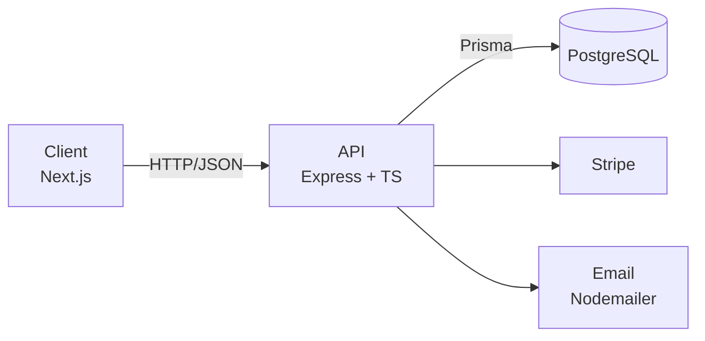
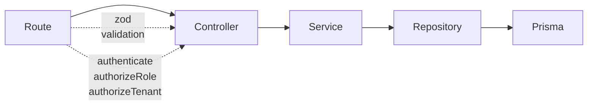
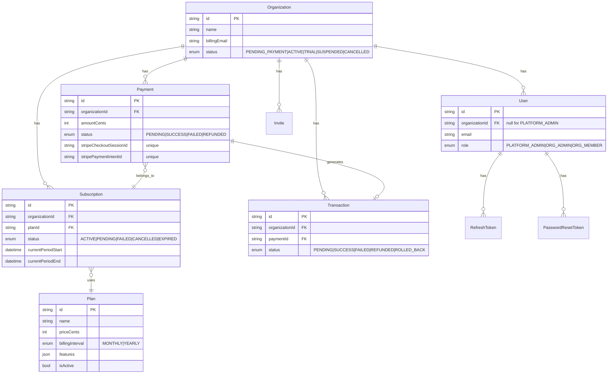
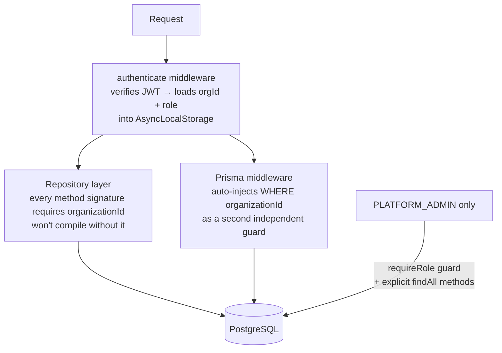
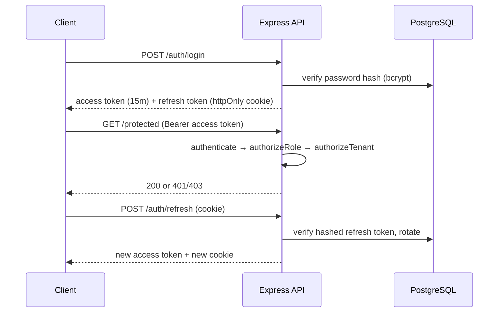
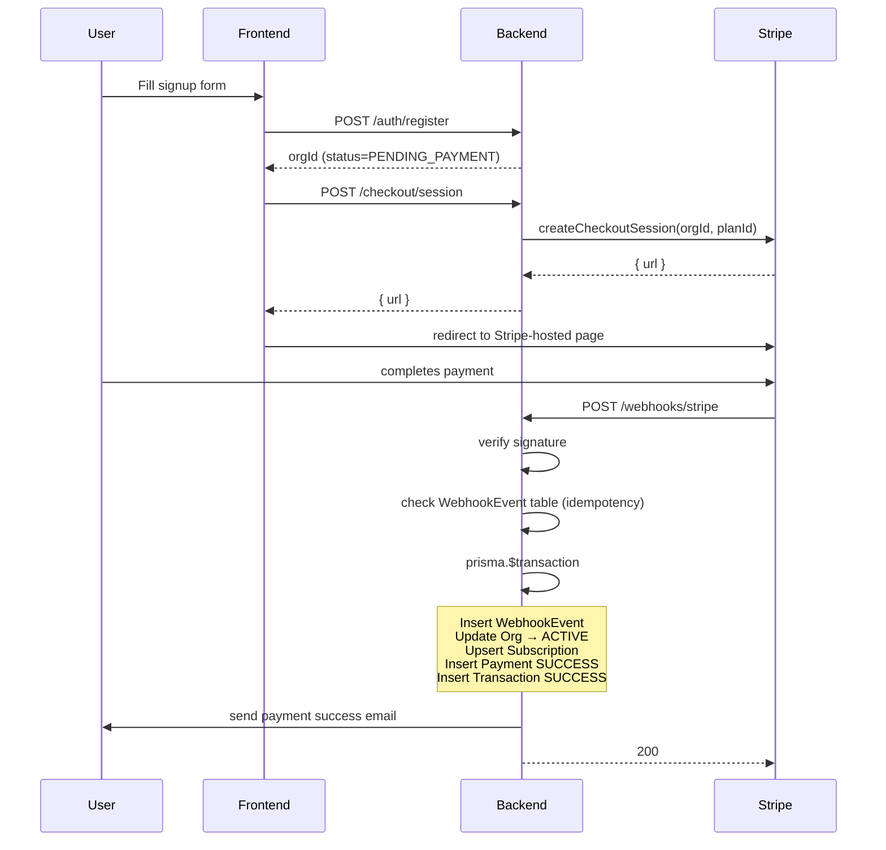
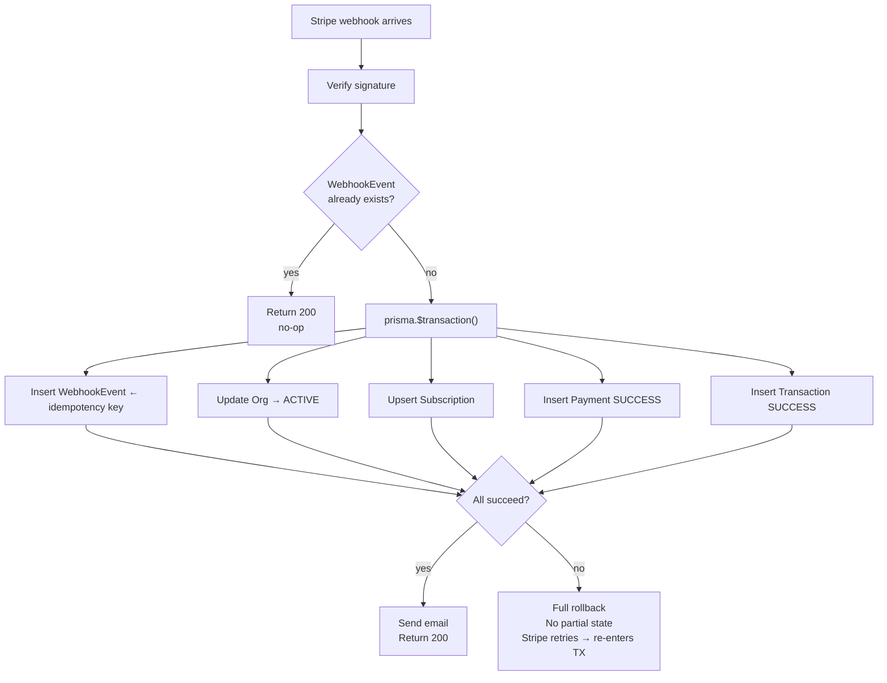

# Octopi SaaS Platform

Multi-tenant SaaS subscription platform. Organizations register, pay via Stripe, and each operates in a fully isolated space — its own users, subscription, and payment history.

---

## Table of Contents

- [Architecture](#architecture)
- [Tech Stack](#tech-stack)
- [Database Design](#database-design)
- [Multi-Tenant Approach](#multi-tenant-approach)
- [Auth Strategy](#auth-strategy)
- [Payment Flow](#payment-flow)
- [Transaction & Rollback](#transaction--rollback)
- [Security Notes](#security-notes)
- [How I Used AI Tools](#how-i-used-ai-tools)
- [How to Run Locally](#how-to-run-locally)
- [Environment Variables](#environment-variables)
- [Test Credentials](#test-credentials)
- [Known Limitations](#known-limitations)

---

## Architecture

Modular monolith — one backend, one frontend. Modules are bounded contexts that can be extracted later without a rewrite.



### Backend Layering



Each layer has one job: Route wires HTTP, Controller shapes req/res, Service owns business logic, Repository is the only Prisma consumer. Providers (Stripe, Nodemailer) implement interfaces so they're swappable via a one-line change in `common/di/container.ts`.

---

## Tech Stack

| Layer          | Choice                                                      |
| -------------- | ----------------------------------------------------------- |
| Frontend       | Next.js 16 (App Router) + TypeScript + shadcn/ui + Tailwind |
| Frontend state | TanStack Query + Zustand                                    |
| Backend        | Express 5 + TypeScript                                      |
| ORM / DB       | Prisma + PostgreSQL                                         |
| Auth           | JWT (access + refresh) + bcrypt                             |
| Payments       | Stripe test mode (Checkout + Webhooks)                      |
| Email          | Nodemailer + Maildev/Ethereal sandbox                       |
| Validation     | zod (backend-authoritative)                                 |
| Tests          | Vitest + Supertest                                          |
| CI             | GitHub Actions                                              |

---

## Database Design



Indexes on every `organizationId` FK column and on `(organizationId, status)` for the Transaction table. `WebhookEvent` uses Stripe's `event.id` as PK — the unique constraint is the idempotency guard.

---

## Multi-Tenant Approach

Shared database, shared schema, `organizationId` discriminator — enforced at **two independent layers**.



- **Layer 1 (Repository)** — type-level contract. No tenant-scoped method exists without `organizationId` in its signature.
- **Layer 2 (Prisma middleware)** — reads `AsyncLocalStorage` context and auto-injects the `WHERE` clause as a safety net.
- Platform Admin is the only role with cross-org access, gated by `requireRole(PLATFORM_ADMIN)` on every request.

---

## Auth Strategy



- Access token: 15 min, `Authorization: Bearer` header
- Refresh token: 7 days, httpOnly cookie, rotated on every use, stored hashed with `revokedAt`
- Forgot/reset: single-use token stored hashed in `PasswordResetToken`, marked `usedAt` on first use
- Rate limiting on `/auth/login`, `/auth/forgot-password`, `/auth/reset-password`

---

## Payment Flow



**Failure path:** `checkout.session.expired` or `payment_intent.payment_failed` → writes `Payment(FAILED)` + `Transaction(FAILED)`, org stays `PENDING_PAYMENT`, user can retry.

---

## Transaction & Rollback

All five writes (WebhookEvent, Organization, Subscription, Payment, Transaction) happen inside a single `prisma.$transaction()`.



Because `WebhookEvent` is inserted inside the same transaction, a retry on a rolled-back event will re-enter the full path and succeed. A retry on a committed event hits the unique PK constraint and short-circuits immediately.

---

## Security Notes

| Concern              | Approach                                                                                       |
| -------------------- | ---------------------------------------------------------------------------------------------- |
| Card data            | Never stored — only Stripe's opaque `sessionId` / `paymentIntentId`                            |
| Webhook authenticity | `stripe.webhooks.constructEvent(rawBody, sig, secret)` — route mounted before `express.json()` |
| Payment verification | Server-side webhook only — frontend redirects never trusted                                    |
| Secrets              | All in environment variables, never in source code                                             |
| Headers              | `helmet` on every response                                                                     |
| CORS                 | Locked to `FRONTEND_URL` only                                                                  |
| Input                | zod validation on every `POST`/`PATCH` — backend authoritative                                 |
| Refresh tokens       | Stored hashed, explicitly revoked on logout                                                    |
| Reset tokens         | Single-use, short-lived, stored hashed                                                         |

---

## How I Used AI Tools

Used Claude and Amazon Q as pair-programming tools throughout:

- **Architecture** — reasoned through shared-schema vs. schema-per-tenant tradeoffs and the idempotent webhook pattern before writing code
- **Boilerplate** — module scaffolding (route/controller/service/repository stubs) generated then reviewed and adjusted
- **Debugging** — used Claude to reason through a `$transaction` + idempotency race condition
- **README** — drafted with AI assistance based on actual code and architecture docs

Every part of the code was read, understood, and manually verified before committing.

---

## How to Run Locally

**Prerequisites:** Node.js 20+, Docker, Stripe CLI

```bash
# 1. Install
git clone <repo-url> && cd octopi-saas-platform
cd backend && npm install
cd ../frontend && npm install

# 2. Start Postgres
docker compose -f docker-compose.backend.yml up -d

# 3. Configure env
cp backend/.env.example backend/.env       # fill in secrets
cp frontend/.env.example frontend/.env.local

# 4. Migrate + seed
cd backend && npx prisma migrate dev && npm run seed

# 5. Start backend (http://localhost:4000)
npm run dev

# 6. Forward Stripe webhooks (new terminal)
stripe listen --forward-to http://localhost:4000/api/v1/webhooks/stripe
# → copy the whsec_... into backend/.env as STRIPE_WEBHOOK_SECRET

# 7. Start frontend (http://localhost:3000)
cd ../frontend && npm run dev
```

---

## Environment Variables

### `backend/.env`

| Variable                 | Description                   |
| ------------------------ | ----------------------------- |
| `DATABASE_URL`           | PostgreSQL connection string  |
| `JWT_ACCESS_SECRET`      | Min 32 chars                  |
| `JWT_REFRESH_SECRET`     | Min 32 chars                  |
| `JWT_ACCESS_EXPIRES_IN`  | e.g. `15m`                    |
| `JWT_REFRESH_EXPIRES_IN` | e.g. `7d`                     |
| `STRIPE_SECRET_KEY`      | `sk_test_...`                 |
| `STRIPE_WEBHOOK_SECRET`  | `whsec_...`                   |
| `SMTP_HOST`              | e.g. `localhost`              |
| `SMTP_PORT`              | e.g. `1025`                   |
| `SMTP_USER`              | Empty for Maildev             |
| `SMTP_PASS`              | Empty for Maildev             |
| `SMTP_FROM`              | From address                  |
| `PORT`                   | Default `4000`                |
| `NODE_ENV`               | `development` or `production` |
| `FRONTEND_URL`           | e.g. `http://localhost:3000`  |

### `frontend/.env.local`

| Variable              | Description                         |
| --------------------- | ----------------------------------- |
| `NEXT_PUBLIC_API_URL` | e.g. `http://localhost:4000/api/v1` |

---

## Test Credentials

Created by `npm run seed`:

| Role           | Email                | Password       |
| -------------- | -------------------- | -------------- |
| Platform Admin | `admin@platform.dev` | `Passw0rd!123` |
| Org Admin      | `admin@acme.dev`     | `Passw0rd!123` |
| Org Member     | `member@acme.dev`    | `Passw0rd!123` |

A second org (`Pending Co`) is seeded in `PENDING_PAYMENT` status to test the checkout/retry flow.

### Stripe Test Cards

Use these on the Stripe-hosted checkout page (any future expiry, any CVC, any ZIP):

| Scenario | Card Number |
| -------- | ----------- |
| ✅ Payment succeeds (India / INR) | `4000 0035 6000 0008` |
| ❌ Card declined | `4000 0000 0000 0002` |
| ❌ Insufficient funds | `4000 0000 0000 9995` |

---

## Known Limitations

- **Frontend partially wired** — auth pages and checkout are functional; platform admin, org admin, and member panel data-fetching/forms are partial scaffolding.
- **No subscription renewal** — initial checkout webhook is handled; `invoice.payment_succeeded` / `invoice.payment_failed` renewal webhooks are not yet wired.
- **No expiring-soon scheduler** — the notification trigger exists in the service layer but no cron job calls it.
- **No invoice PDF** — payment history is shown but no downloadable PDF (bonus item).
- **No per-org SMTP** — `NotificationProvider` interface supports it but the second implementation isn't built (bonus item).
- **CI runs typecheck only** — `tsc --noEmit` on push; test execution not wired (needs a Postgres `services:` block in the workflow).
